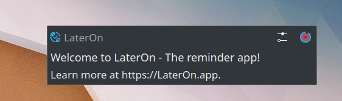
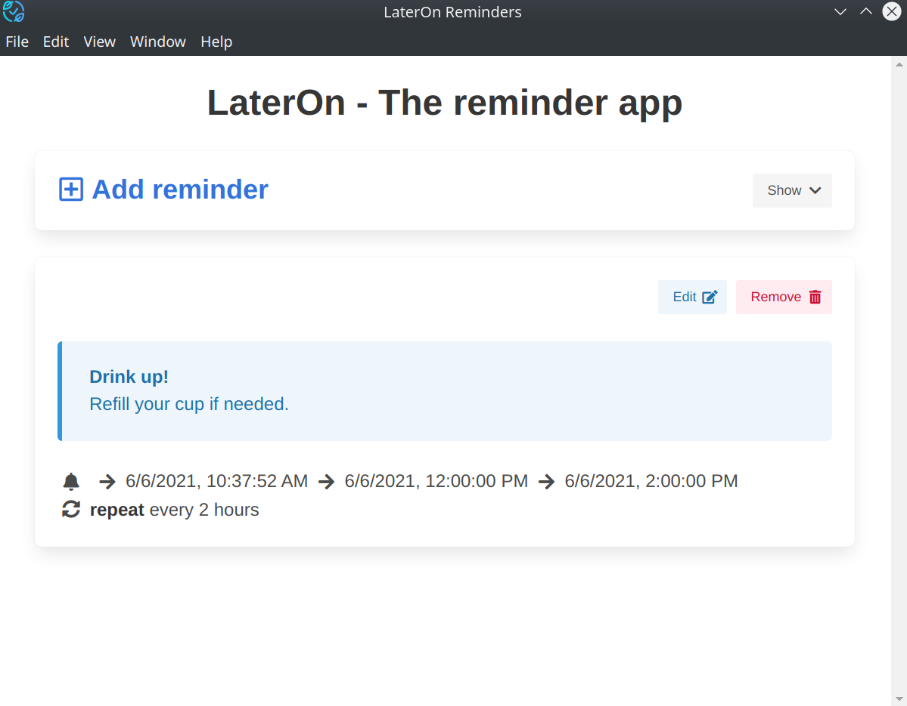
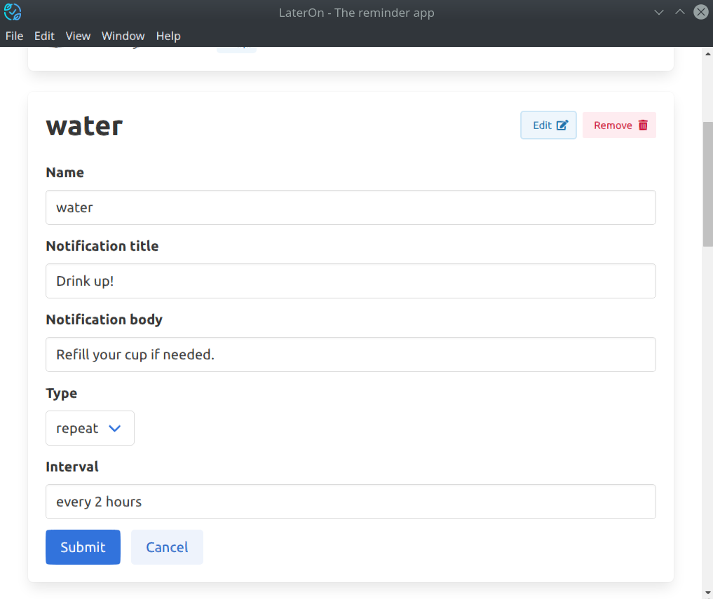
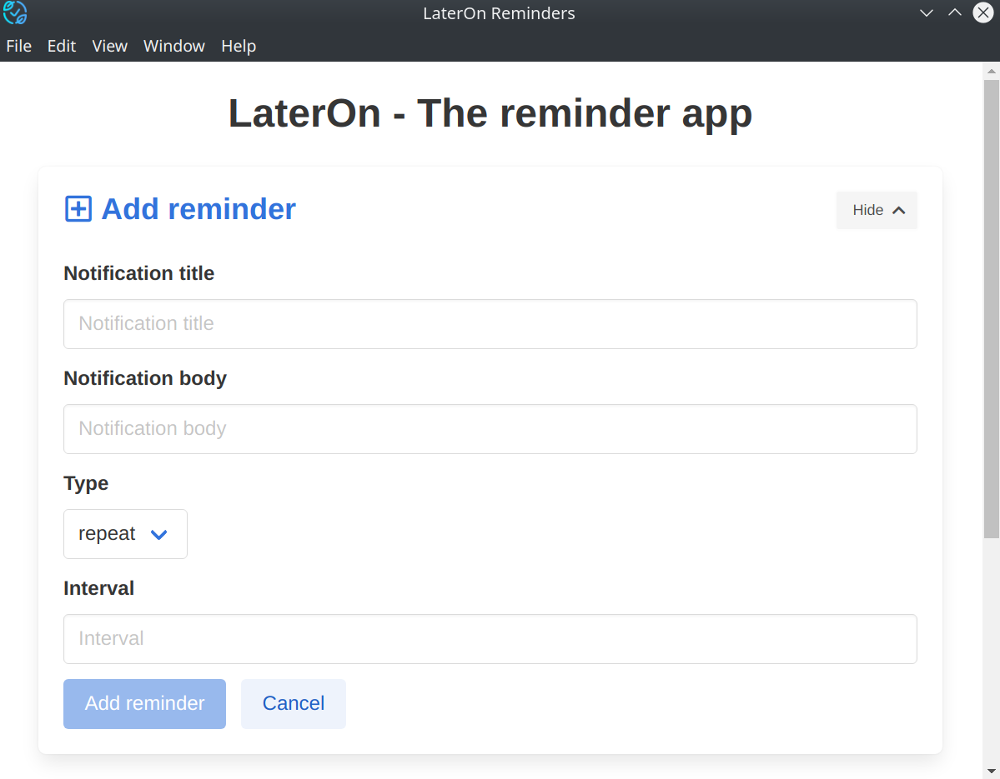

# LaterOn  

> **The reminder app**

*LaterOn* is a cross-platform [Electron](https://www.electronjs.org/) app that allows you to create custom reminders.

Download it from [Releases page](https://github.com/hovancik/later-on/releases).

 

## Reminders

*LaterOn* lives in your tray and sends the reminders as defined by your schedule. They appear in a form of a regular OS notification. Here's an example of the default reminder that comes on the start of the app:

You can manage your reminders from tray "Reminders" menu.

Example notification is show, together with the next occurrences and the rule. You can then edit or remove a reminder.

**Notification title** is a title of the notification that you'll receive.

**Notification body** is a body of the notification that you'll receive.

**Type** is an type of interval that you want to use. Can be either:
  - **repeat** - notification is repeated according to the specified interval,
  - **once** notification is shown once and then deleted - unless *Don't remove after the notification.* is checked.
  - **cron** - which is a specific syntax for repeat type

**Interval** let's you specify schedule for notifications.

Here are some examples for *repeat* and *once* type *intervals*:
- `every weekday at 9:00am also at 2:00pm`
- `every weekday every 60 min starting on the 30th min after 8th hour and before 18th hour`

Syntax is very flexible and you can learn more at [the docs of the used library](https://breejs.github.io/later/parsers.html#text).

You can also use [cron](https://breejs.github.io/later/parsers.html#cron) syntax.

Same rules apply when adding new reminder.

## Credits

[Icon](https://www.flaticon.com/free-icon/ecology_2768313) made by [Freepik](http://www.freepik.com/) from [Flaticon](https://www.flaticon.com/).
